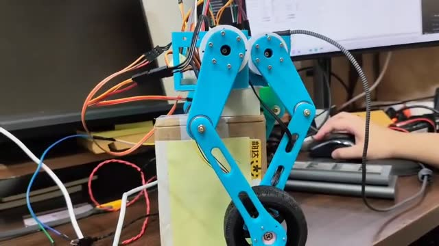
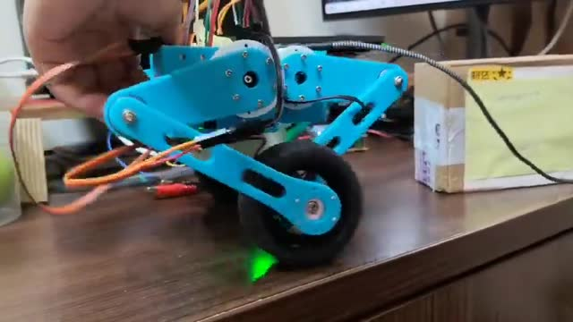

# Wheeled Biped Robot（雙輪足）

本專案包含雙輪足機器人的 MuJoCo 模擬，以及 ESP32、DengFOC 與 Python GUI 的控制程式。

- `Mujoco/`：五連桿雙輪模型、LQR 平衡模擬與 Viewer。
- `Integrated_Control_System/Integrated_Robot_Control_Package/`：ESP32 姿態與伺服控制、DengFOC 馬達韌體、Python GUI。
- `maltab_simulate/LQR/`：MATLAB LQR 計算程式。
- `media/`：專題展示影片。

模擬已通過基本測試；整機實機平衡仍需驗證。

## MATLAB LQR 運算

## 模擬顯示

## 實機展示

點擊預覽圖開啟實機影片。

### 高度控制

[觀看高度控制影片](media/高度控制_480p.mp4)

### 平衡控制

[觀看平衡控制影片](media/平衡控制_480p.mp4)

## 參考資料

- [MathWorks：`lqr` 線性二次調節器](https://www.mathworks.com/help/control/ref/lti.lqr.html) — MATLAB LQR 增益計算。
- [MuJoCo：MJCF 模型文件](https://mujoco.readthedocs.io/en/stable/modeling.html) — 雙輪足模型與物理模擬。
- [DengFOC 開源函式庫](https://github.com/ToanTech/DengFOC_Lib) — 無刷馬達 FOC 控制參考。
- [Espressif：Arduino-ESP32 文件](https://docs.espressif.com/projects/arduino-esp32/en/latest/) — ESP32 韌體開發。
- [ams OSRAM：AS5600 資料表](https://look.ams-osram.com/m/7059eac7531a86fd/original/AS5600-DS000365.pdf) — 磁編碼器規格。
